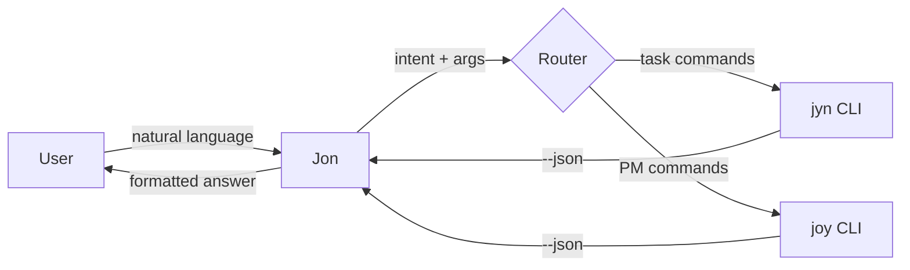
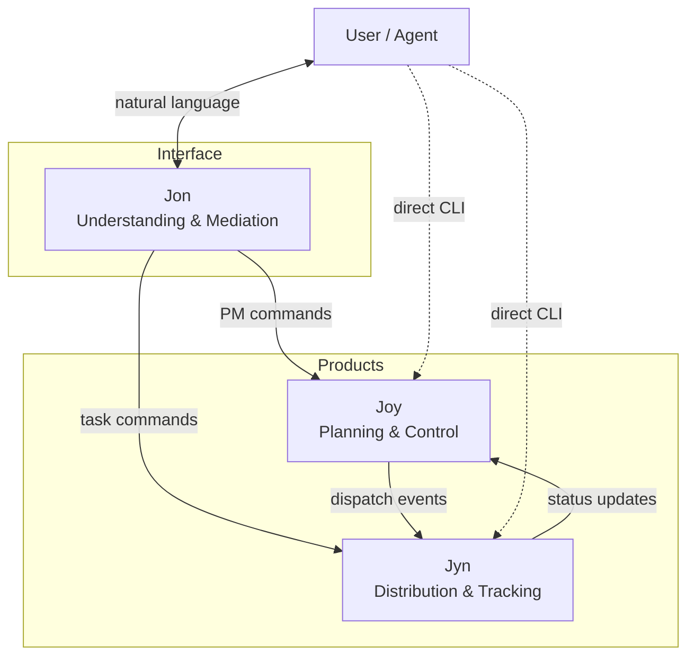

# Jon - Natural Language Interface for the Joyint Ecosystem

As of: 2026-04-08

## Executive Summary

Jon is a natural language interface for Joy and Jyn - available as a CLI binary on the terminal and as a chat window in the Joyint WebUI and apps. Jon has no data layer of its own - it calls Joy and Jyn under the hood and translates between human language and structured commands.

```
jon "what's my next task?"           --> jyn ls --sort=priority --limit=1
jon "move JOY-0045 to review"        --> joy status JOY-0045 review
jon "how much did AI cost this week" --> joy costs --since=monday
jon "remind me to deploy at 3pm"     --> jyn add "deploy" --due=15:00 --remind
```

Jon completes the Joyint product trio: Joy plans and controls, Jyn distributes and tracks, Jon understands and mediates. The name works like "ask Siri" or "hey Alexa" - a person, not an acronym.

**Core principle:** Jon always works. From air-gapped to cloud-connected, the interface stays the same - only the intelligence behind it scales.

**Timing:** Jon MVP (Tier 0) can ship alongside Joy and Jyn in Phase 1-2. Tier 2 (LLM-backed) follows in Phase 3+.

-----

## Architecture: Three Tiers of Intelligence

Jon is not one system - it's three tiers that activate based on what's available. Each tier handles a broader class of queries. The interface never changes.

### Tier 0: Pattern Router (built-in, instant, offline)

A deterministic command router using keyword matching and regex patterns. No NLP, no tokenizer - pure Rust, a few hundred lines. Handles ~80% of daily commands.

```rust
match input {
    // Specific patterns first
    s if RE_MOVE_STATUS.is_match(s) => route_status_transition(s),
    s if RE_COST_QUERY.is_match(s)  => route_cost_query(s),
    s if RE_REMIND.is_match(s)      => route_add_reminder(s),

    // Keyword-based intents
    s if has_keywords(s, &["next", "task", "todo"]) => route_next_task(s),
    s if has_keywords(s, &["board", "overview"])     => route_board(s),
    s if has_keywords(s, &["roadmap"])               => route_roadmap(s),

    // Fallback
    _ => suggest_closest_match(s),
}
```

**What it handles:** Status transitions, task listing, cost queries, adding reminders, searching items, showing boards/roadmaps - anything that maps to a concrete Joy/Jyn command.

**What it costs:** Zero bytes extra, zero latency, zero dependencies.

### Tier 1: Local Mini-LLM (opt-in download, offline)

A quantized small language model (1-3B parameters) running locally via `candle` (Rust-native inference). Models like Phi-3-mini, Qwen2.5-1.5B, or TinyLlama fit in 1-2 GB RAM and run on CPU.

```bash
# First time: Jon downloads the model
jon --setup-llm
# --> Downloading jon-model (1.2 GB) to ~/.jon/model/

# Afterwards: local, offline, private
jon "summarize what happened on epic JOY-0012 this week"
```

**What it handles:** Summarization, vague queries, natural language intent recognition beyond keyword matching, simple reasoning over project context.

**What it costs:** ~1-2 GB disk for the model, 2-5 seconds inference time per query on CPU.

**Build priority:** Low. Tier 0 and Tier 2 cover the critical path. Tier 1 is a nice-to-have for privacy-conscious users who want more than pattern matching but won't connect to an external LLM. Worth building once Jon has enough traction to justify the maintenance overhead (model management, quantization, cross-platform testing).

### Tier 2: External LLM (API key or Joyint Pro)

Full LLM power via the user's own API key (OpenAI, Anthropic, local Ollama) or through Joyint Pro.

```bash
# Bring your own key
export JON_LLM=anthropic
export ANTHROPIC_API_KEY=sk-...

# Or via Joyint Pro (no key needed)
jon login

# Full power
jon "plan the implementation for JOY-0012, break it into subtasks"
jon "what should I prioritize this week based on milestone deadlines?"
jon "review the cost trend for AI jobs and flag anomalies"
```

**What it handles:** Complex reasoning, multi-step planning, context-aware recommendations, agent orchestration, cross-item analysis, natural conversation about project state.

**What it costs:** API usage fees (own key) or via Joyint Pro.

### Tier Selection Logic

Jon picks the highest available tier automatically. The user never has to think about it.

```
Query arrives
  |
  +--> Pattern match found? --> Tier 0 (instant)
  |
  +--> Local model installed? --> Tier 1 (2-5s)
  |
  +--> LLM configured? --> Tier 2 (1-3s)
  |
  +--> No match, no LLM --> Helpful fallback
```

The fallback is critical. When Jon can't resolve a query locally, it doesn't just say "I don't understand":

```
I can't handle that locally.
Did you mean: jon status JOY-0045 review

For natural language queries:
  jon --setup-llm        (offline, ~1.2 GB download)
  export JON_LLM=openai  (your own API key)
  jon login               (Joyint Pro)
```

Every failed query is a signpost to the next tier - and to Joyint Pro.

-----

## Subprocess Architecture: Jon Owns Nothing

Jon has no data layer, no YAML parser, no Git integration, no state. It is a pure orchestrator that calls `joy` and `jyn` as subprocesses.



### Why This Is the Right Design

**No duplicated logic.** Jon doesn't parse YAML, doesn't understand status workflows, doesn't know about milestones. Joy and Jyn handle all domain logic. When Joy gets a new feature, Jon benefits immediately.

**No cache invalidation.** Jon doesn't maintain state. Every query is a fresh subprocess call. No stale data, no sync problems.

**No version coupling.** Jon depends on Joy/Jyn's `--json` output format, not their internals. As long as the JSON contract is stable, Jon, Joy, and Jyn can be versioned independently.

**Testable in isolation.** Jon's test suite only needs to verify: (1) correct intent parsing, (2) correct command construction, (3) correct output formatting. No YAML fixtures, no Git repos, no filesystem setup.

### The JSON Contract

Joy and Jyn need a `--json` output flag. This is Jon's stable interface - human-readable output can change freely, JSON is the API contract.

```bash
# Jon calls internally:
jyn ls --json --sort=priority --limit=1
# --> [{"id":"JOT-001","title":"Deploy","due":"2026-04-09T15:00","priority":1}]

# Jon formats for the user:
# --> Your next task: "Deploy" (due today 3pm, high priority)
```

For Tier 2 (LLM), Jon feeds the JSON output as context into the prompt:

```
System: You are Jon, a project assistant. The user asked: "what should I work on next?"
Context (from jyn ls --json): [{"id":"JOT-001","title":"Deploy",...},{"id":"JOT-002",...}]
Context (from joy ls --json --status=in_progress): [{"id":"JOY-0045",...}]
Respond concisely.
```

### Graceful Degradation

Jon checks for `joy` and `jyn` in PATH at startup and reports their versions. If one is missing, Jon degrades gracefully:

```bash
# Only jyn installed
jon "what's next?"        # --> works (routes to jyn)
jon "show roadmap"        # --> "joy is not installed. Run: curl -fsSL get.joyint.com/joy | sh"

# Neither installed
jon "hello"               # --> "Jon needs joy and/or jyn. Run: curl -fsSL get.joyint.com/all | sh"
```

This makes Jon the ideal entry point for new users: install Jon first, it tells you what else you need and helps you get it.

-----

## Product Role: The Third Pillar

### The Trio

```
Joy   = Planning and Control      (PM, Governance, AI orchestration)
Jyn   = Distribution and Tracking (Task dispatch, Reminders, CalDAV)
Jon   = Understanding and Mediation (Natural language, Context, Intelligence)
```

Joy plans an AI job, Jyn distributes the task to an agent or person, Jon is the conversational layer that lets anyone interact with the system without memorizing commands.



Jon doesn't replace the direct CLIs. Power users will always type `joy status JOY-0045 review` directly. Jon is for everyone else - and for power users when they want to ask a question instead of constructing a query.

### Jon as Onboarding Layer

A new user's first interaction with the Joyint ecosystem should be Jon:

```bash
# Install
curl -fsSL get.joyint.com/jon | sh

# First run
jon "help me get started"
# --> I see joy and jyn aren't installed yet.
#     Joy is a project management tool, Jyn is a task manager.
#     Want me to install both? (Y/n)

# After setup
jon "create a new project called Acme"
# --> joy init acme
# --> Created project Acme in ./acme/.joy/

jon "add a task: set up CI pipeline"
# --> joy add "Set up CI pipeline" --type=task
# --> Created JOY-0001: Set up CI pipeline
```

Jon absorbs the learning curve. Instead of reading docs to understand the difference between `joy add` and `jyn add`, users describe what they want and Jon routes it.

### Jon as Toolchain Manager

Beyond routing commands, Jon manages the Joyint toolchain itself - installing, updating, and diagnosing Joy and Jyn.

```bash
jon install joy          # downloads joy via get.joyint.com/joy
jon install jyn          # downloads jyn via get.joyint.com/jyn
jon install all          # both
jon update               # updates all installed tools + jon itself
jon update joy           # only joy
jon doctor               # checks versions, compatibility, PATH, JSON schema
```

```
$ jon doctor
  jon   v0.3.0   ✓ up to date
  joy   v0.8.1   ✓ up to date    (JSON schema v2, compatible)
  jyn   v0.5.0   ⚠ update available (v0.5.2)
  PATH            ✓ all binaries found
  LLM             ✓ Joyint Pro connected

  Run 'jon update jyn' to update.
```

This makes Jon the single entry point for toolchain management - like `rustup` for Rust. One command to install, update, and diagnose everything.

**Important distinction:** The primary installation path remains `get.joyint.com/all`, which installs all three binaries at once. Jon's install and update commands are for afterwards - adding tools later, pulling updates, running health checks. Jon is the toolbox that stays, not the first-contact installer.

### Jon as AI Member: The User's Right Hand

Jon can go beyond answering questions. As a project member's personal assistant, Jon can act on their behalf - picking up tasks, triggering AI jobs, and managing workflow transitions. The step from "answer questions" to "do things when I say so" is architecturally small: Jon already has subprocess access to Joy and Jyn.

```bash
# Passive: answer questions
jon "what's blocking JOY-0012?"

# Active: act on behalf of the user
jon "pick up JOY-0012 and start implementing"
# --> joy assign JOY-0012 --to=horst
# --> joy status JOY-0012 in_progress
# --> joy ai implement JOY-0012
# --> ...working...
# --> Jon: "Done. PR ready for review. Cost: 2.40 EUR."
```

Jon doesn't introduce a new agent type. It uses Joy's existing `joy ai` commands - estimation, planning, implementation, review. Jon is the layer that asks "should I?" instead of requiring the user to know the exact command.

**The difference between Jon and Joy's agent orchestration:**

```
joy ai implement JOY-0012    --> Joy drives the agent directly
jon "implement JOY-0012"      --> Jon confirms, then calls joy ai
```

Joy is the engine. Jon is the copilot who operates the engine - with confirmation prompts, context summaries, and guardrails. This maps directly to Joy's existing `allow_ai` gate model: Jon asks the human before doing anything destructive, exactly like a good assistant would.

**Identity: Jon is not an agent.**

Jon never acts as an autonomous actor. It always acts *on behalf of the logged-in user*. In the audit log, the entry reads `user:horst via jon`, not `agent:jon`. This distinction is critical for governance:

| Actor | Audit Log Entry | Autonomy |
|-------|----------------|----------|
| Human directly | `user:horst` | Full |
| Human via Jon | `user:horst via jon` | Human-initiated, Jon-executed |
| AI Agent | `agent:implementer@joy` | Autonomous within gates |

Jon inherits the user's permissions, respects the same status gates, and is subject to the same `allow_ai` constraints. If a gate says `allow_ai: false`, Jon can't push through it either - it tells the user "this transition requires manual approval" and stops.

**What this enables:**

```bash
# Morning standup with Jon
jon "what's on my plate today?"
# --> 3 items assigned to you:
#     JOY-0045  API endpoint    (in progress, due today)
#     JOY-0051  Fix login bug   (ready, high priority)
#     JOT-012   Review PR #38   (due 2pm)

jon "start with the login bug, then do the API endpoint"
# --> Assigning JOY-0051 to in_progress...
# --> Running joy ai implement JOY-0051...
# --> [works for 3 minutes]
# --> JOY-0051 done. PR #41 created. Cost: 1.80 EUR.
# --> Moving to JOY-0045...
# --> Running joy ai implement JOY-0045...

jon "pause, I need to review something first"
# --> Paused. JOY-0045 is still in progress.
#     Resume with: jon "continue with JOY-0045"
```

Jon becomes the user's terminal copilot - understanding intent, managing sequence, respecting governance, and staying interruptible at every step.

### Jon as Multi-Project Aggregator

Joy is deliberately scoped to a single repository - git-native, YAML in the repo, no cross-repo logic. This is the right design for Joy: clean boundaries, no data model bloat, no leaking state between projects.

But real work spans multiple projects. A founder runs three repos. A team lead oversees five. An enterprise has hundreds. Someone needs to aggregate across them. That's Jon.

```bash
jon "show roadmap across all projects"
# --> joy roadmap --json   (in ~/acme/.joy/)
# --> joy roadmap --json   (in ~/beta/.joy/)
# --> joy roadmap --json   (in ~/gamma/.joy/)
# --> merged timeline, sorted by milestone dates

jon "what's the highest priority across everything?"
# --> joy ls --json + jyn ls --json (per project)
# --> aggregated, sorted by priority and deadline

jon "how much did AI cost across all projects this month?"
# --> joy costs --json --since=2026-04-01 (per project)
# --> summed: Acme 340 EUR, Beta 120 EUR, Gamma 85 EUR. Total: 545 EUR.

jon "are there any overdue items anywhere?"
# --> joy ls --json --overdue (per project)
# --> 2 overdue in Acme, 0 in Beta, 1 in Gamma
```

**Project registry:** Jon needs to know which projects exist. A minimal config:

```yaml
# ~/.jon/projects.yaml
projects:
  - name: Acme
    path: ~/work/acme
  - name: Beta
    path: ~/work/beta
  - name: Gamma
    path: ~/work/gamma
```

Or managed dynamically:

```bash
jon add project ~/work/acme
jon add project ~/work/beta
jon projects                    # list registered projects
jon remove project beta         # unregister
```

**The architecture stays clean.** Joy owns single-project data. Jon calls `joy` n times (once per project), collects the JSON outputs, and merges them. No new data layer, no cross-project database, no shared state. The same subprocess pattern as everything else Jon does - just iterated across projects.

**Server-side aggregation.** Locally, Jon can only aggregate projects that exist on the user's machine. On Joyint, Jon sees all projects the user has access to - including repos they don't have checked out locally. This unlocks server-side features that can't work in the CLI:

| Capability | Jon CLI (local) | Jon on Joyint (Pro) |
|-----------|----------------|-------------------|
| Aggregate local projects | Yes | Yes |
| Aggregate remote projects | No (not checked out) | Yes (server-side access) |
| Cross-project dashboards | Basic (terminal output) | Rich (WebUI charts, timelines) |
| Team-wide roadmaps | Only own projects | All projects user has access to |
| Organization-wide cost overview | No | Yes |
| Cross-project dependency tracking | No | Planned |

Multi-project management is where Jon's value scales from individual convenience to organizational necessity.

-----

## Demarcation: Jon vs. Joy Skill

Joy also provides a Skill/MCP-Server definition that gives AI coding tools (Claude Code, Cursor, GitHub Copilot) direct access to Joy and Jyn commands. This is a separate, independent feature - not part of Jon.

The distinction:

| | Jon | Joy Skill |
|---|-----|-----------|
| **What it is** | Specialized assistant with project context | Generic tool interface for external LLMs |
| **Where it runs** | Terminal (CLI) or Joyint (chat window) | Inside AI coding tools (Claude, Cursor, etc.) |
| **Intelligence** | Optimized prompts, project-specific context injection, learned patterns | LLM uses Joy/Jyn commands as raw tools |
| **Context awareness** | Builds specialized context from Joy's YAML store per query | LLM manages its own context |
| **Offline capable** | Yes (Tier 0 pattern router, Tier 1 local LLM) | No (requires external LLM) |
| **Target user** | Anyone - including users without AI coding tools | Developers already working in an AI-assisted IDE |

The Joy Skill tells an LLM "you *can* call `joy status`." Jon knows "for *this* project, you call `joy status` *this way*, with *this* context, in *this* order, avoiding *these* known issues." The Skill is an API. Jon is an assistant.

Both coexist without conflict. A developer might use the Joy Skill in Cursor for ad-hoc queries during coding, and use Jon in the terminal for morning standup or task sequencing. Different tools for different moments.

-----

## Technical Design

### Crate Structure

```
jon-cli/                    # Binary crate (MIT)
  src/
    main.rs                 # Entry point, argument parsing
    router/
      mod.rs                # Tier selection logic
      pattern.rs            # Tier 0: regex/keyword matching
      local_llm.rs          # Tier 1: candle integration (feature-gated)
      remote_llm.rs         # Tier 2: API client (OpenAI, Anthropic, Ollama, Joyint)
    subprocess/
      mod.rs                # Joy/Jyn subprocess execution
      json_parse.rs         # JSON output parsing
      discovery.rs          # PATH detection, version checking
    format/
      mod.rs                # Output formatting for terminal
```

No `jon-core` crate needed. Jon is thin by design - all domain logic lives in `joy-core` and `jyn-core`.

### Feature Gates

Tier 1 (local LLM) is behind a Cargo feature flag to keep the default binary small:

```toml
[features]
default = []
local-llm = ["candle-core", "candle-transformers", "hf-hub"]
```

```bash
# Default install: Tier 0 + Tier 2 only (~5 MB binary)
cargo install jon-cli

# With local LLM support: adds candle dependencies (~15 MB binary)
cargo install jon-cli --features local-llm
```

The curl installer (`get.joyint.com/jon`) ships the default binary. Tier 1 is an explicit opt-in.

### Subprocess Execution

```rust
use std::process::Command;

fn call_joy(args: &[&str]) -> Result<serde_json::Value> {
    let output = Command::new("joy")
        .args(args)
        .arg("--json")
        .output()?;

    if !output.status.success() {
        let stderr = String::from_utf8_lossy(&output.stderr);
        return Err(JonError::JoyFailed(stderr.to_string()));
    }

    let json: serde_json::Value = serde_json::from_slice(&output.stdout)?;
    Ok(json)
}
```

### Example: Full Query Flow

```
User: jon "what's blocking JOY-0012?"

1. Tier 0 pattern match:
   - Keywords: "blocking", Joy item ID
   - Intent: show_blockers
   - Command: joy deps JOY-0012 --json --direction=blocking

2. Subprocess call:
   joy deps JOY-0012 --json --direction=blocking
   --> [{"id":"JOY-0008","title":"API schema","status":"in_progress"},
        {"id":"JOY-0010","title":"Auth module","status":"blocked"}]

3. Format output:
   JOY-0012 is blocked by 2 items:
     JOY-0008  API schema     (in progress)
     JOY-0010  Auth module    (blocked)

4. If Tier 2 available, enhance:
   JOY-0012 is blocked by 2 items. JOY-0010 is itself blocked,
   creating a chain. Resolving JOY-0008 first would unblock the
   most items downstream.
```

Tier 0 gives the facts. Tier 2 adds reasoning. Same query, same interface, different depth.

-----

## What Jon Is NOT

- **Not a chatbot.** Jon is a command translator, not a conversation partner. Queries in, answers out. No session state, no personality, no smalltalk (unless the LLM tier adds it naturally).
- **Not a replacement for Joy or Jyn.** Both CLIs remain first-class interfaces. Jon is additive, not substitutive.
- **Not a replacement for the Joy Skill.** The Joy Skill gives AI coding tools (Claude, Cursor) generic access to Joy/Jyn commands. Jon is a specialized assistant with project-specific context. Both coexist independently.
- **Not a data store.** Jon has no database, no cache, no config files beyond LLM credentials. All project data lives in Joy's and Jyn's YAML files.
- **Not an agent.** Jon doesn't execute multi-step plans autonomously. It translates a single query into one or more commands, shows the result, and waits for the next query. Agent orchestration is Joy's domain (`joy ai implement`).
- **Not required.** The Joyint ecosystem works without Jon. Jon is fully opt-in - on the CLI (don't install it), in the WebUI (toggle it off), in the apps (same toggle). Joy, Jyn, and the Joy Skill function identically with or without Jon.

-----

## Vision: Jon as the Universal Entry Point

### Short Term (2026)

Jon is a fast, useful CLI shortcut. Users who already know Joy and Jyn use Jon for quick queries ("what's next?", "how much did AI cost?"). New users discover the ecosystem through Jon without reading documentation first.

### Medium Term (2027)

Jon becomes the preferred way to interact with Joyint for non-power-users. Designers, QA testers, project managers - people who don't want to learn CLI syntax - use Jon as their window into the project. CalDAV delivers their tasks, Jon answers their questions.

### Long Term (2028+)

Jon is the natural language API for the entire Joyint ecosystem. Third-party tools integrate via Jon rather than calling Joy/Jyn directly. AI agents use Jon as their interface to project context. The question shifts from "how do I use Joy?" to "just ask Jon."

```
Today:     Your data | Your repo | Your terminal | Your AI agents
Tomorrow:  Your data | Your repo | Your terminal | Your AI agents | Your assistant
```

No lock-in on data (YAML/Git). No lock-in on code (MIT). No lock-in on infrastructure (BYOG). No lock-in on intelligence (bring your own LLM). The most consistent "no lock-in" story in the PM market - now extended to the interface layer.
